<div align="center">

<!-- ANIMATED HEADER -->


<br/>

<!-- TYPING ANIMATION -->
<p align="center">
  
</p>

<!-- SOCIAL BADGES -->
<p align="center">
  <a href="https://veerapandig.vercel.app" target="_blank">
    
  </a>
  <a href="https://linkedin.com/in/veera-crt" target="_blank">
    
  </a>
  <a href="https://youtube.com" target="_blank">
    
  </a>
  <a href="mailto:veera@example.com">
    
  </a>
  <a href="https://github.com/veera-crt" target="_blank">
    
  </a>
</p>

<!-- PROFILE VIEWS COUNTER -->
<p align="center">
  
  
</p>

<br/>

<!-- ABOUT ME SECTION -->


## 🎯 **About Me**

```yaml
name: Veerapandi G
role: Cybersecurity Engineer & DevSecOps Specialist
location: Tamil Nadu, India
education: B.Tech in Computer Science (Cybersecurity)
current_focus: 
  - Offensive Security & Penetration Testing
  - Cloud Security Architecture
  - Security Automation & DevSecOps
  - Threat Intelligence & Incident Response

philosophy: |
  "Security is not a product, but a process of continuous improvement.
   I engineer trust by building systems that are secure by design,
   not as an afterthought."

currently_learning:
  - Advanced Exploitation Techniques
  - Cloud Native Security (K8s, Docker)
  - Threat Hunting & SIEM Analytics
  - Security Research & Vulnerability Analysis
```

<br/>

<!-- TECH STACK SECTION -->


## 🛠️ **Technology Arsenal**

### **Languages & Scripting**
<p align="left">
  
  
  
  
  
  
</p>

### **Security Tools & Frameworks**
<p align="left">
  
  
  
  
  
  
</p>

### **DevOps & Cloud**
<p align="left">
  
  
  
  
  
  
</p>

### **Web Technologies**
<p align="left">
  
  
  
  
</p>

<br/>

<!-- CYBERSECURITY ROADMAP -->


## 🗺️ **Cybersecurity Journey**

```mermaid
%%{init: {'theme':'dark', 'themeVariables': { 'primaryColor':'#00d9ff','primaryTextColor':'#fff','primaryBorderColor':'#00d9ff','lineColor':'#00d9ff','secondaryColor':'#1a1e22','tertiaryColor':'#0d1117'}}}%%
graph LR
    A[🖥️ Hardware<br/>Fundamentals] --> B[🌐 Networking<br/>TCP/IP]
    B --> C[🐧 Linux<br/>System Admin]
    C --> D[🔒 Network<br/>Security]
    D --> E[📋 GRC &<br/>Compliance]
    E --> F[🔍 Vulnerability<br/>Assessment]
    F --> G[⚔️ Offensive<br/>Security]
    G --> H[🛡️ Defensive<br/>Security]
    H --> I[👨‍💻 Ethical<br/>Hacker]
    
    style A fill:#2e7d32,stroke:#4caf50,stroke-width:3px,color:#fff
    style B fill:#2e7d32,stroke:#4caf50,stroke-width:3px,color:#fff
    style C fill:#2e7d32,stroke:#4caf50,stroke-width:3px,color:#fff
    style D fill:#2e7d32,stroke:#4caf50,stroke-width:3px,color:#fff
    style E fill:#2e7d32,stroke:#4caf50,stroke-width:3px,color:#fff
    style F fill:#1565c0,stroke:#00d9ff,stroke-width:3px,color:#fff
    style G fill:#1565c0,stroke:#00d9ff,stroke-width:3px,color:#fff
    style H fill:#1565c0,stroke:#00d9ff,stroke-width:3px,color:#fff
    style I fill:#1565c0,stroke:#00d9ff,stroke-width:3px,color:#fff
```

<p align="center">
  
</p>



<br/>

<!-- CERTIFICATIONS SECTION -->


## 🏆 **Certifications & Achievements**

<table width="100%">
  <tr>
    <td width="50%" valign="top">
      
### 🎓 **Active Certifications**
      
- 🔹 **(ISC)² Certified in Cybersecurity (CC)** 
  
  
- 🔹 **NPTEL - System Security** 
  
  
- 🔹 **NPTEL - Ethical Hacking** 
  
  
- 🔹 **NPTEL - Java Programming** 
  

    </td>
    <td width="50%" valign="top">
      
### 🎯 **Target Certifications**
      
- 🔸 **CEH (Certified Ethical Hacker)** - Q2 2026
- 🔸 **ISO 27001 Lead Implementer** - Q3 2026
- 🔸 **ITIL Foundation** - Q3 2026
- 🔸 **OSCP (Offensive Security)** - Q4 2026
- 🔸 **AWS Security Specialty** - 2027

    </td>
  </tr>
</table>

<br/>

<!-- EXPERIENCE SECTION -->


## 💼 **Professional Experience**

<table width="100%">
  <tr>
    <td width="33%" align="center">
      
      <h4>Media Team Lead</h4>
      <p><b>IEI Club</b></p>
      <p><i>Sep 2025 - Present</i></p>
      <p>Leading digital content strategy and technical documentation</p>
    </td>
    <td width="33%" align="center">
      
      <h4>Security Intern</h4>
      <p><b>Palo Alto Networks</b></p>
      <p><i>2025 - 2026</i></p>
      <p>Network security & threat prevention research</p>
    </td>
    <td width="33%" align="center">
      
      <h4>Security Analyst Intern</h4>
      <p><b>Tata Group (Forage)</b></p>
      <p><i>2025 - 2026</i></p>
      <p>Cybersecurity operations & incident response</p>
    </td>
  </tr>
  <tr>
    <td width="50%" align="center">
      
      <h4>Technical Team Member</h4>
      <p><b>NWC Association</b></p>
      <p><i>Jan 2025 - Dec 2025</i></p>
      <p>Technical implementation & security auditing</p>
    </td>
    <td width="50%" align="center">
      
      <h4>Content Creator</h4>
      <p><b>The Joy Of Cyber</b></p>
      <p><i>Dec 2024 - Present</i></p>
      <p>Cybersecurity education & awareness content</p>
    </td>
  </tr>
</table>

<br/>

<!-- ACADEMIC PERFORMANCE -->


## 📚 **Academic Excellence**

<p align="center">
  
</p>

<table width="100%">
  <tr>
    <td width="70%" align="center">
      <h3>📊 Semester-wise Performance</h3>
      <table width="100%">
        <tr>
          <th>Semester</th>
          <th>SGPA</th>
          <th>Performance</th>
        </tr>
        <tr>
          <td align="center">Semester 1</td>
          <td align="center"><b>7.82</b></td>
          <td align="center">
            
          </td>
        </tr>
        <tr>
          <td align="center">Semester 2</td>
          <td align="center"><b>8.48</b></td>
          <td align="center">
            
          </td>
        </tr>
        <tr>
          <td align="center">Semester 3</td>
          <td align="center"><b>8.96</b></td>
          <td align="center">
            
          </td>
        </tr>
        <tr>
          <td align="center">Semester 4</td>
          <td align="center"><b>9.35</b></td>
          <td align="center">
            
          </td>
        </tr>
        <tr>
          <td align="center">Semester 5</td>
          <td align="center"><b>Ongoing</b></td>
          <td align="center">
            
          </td>
        </tr>
      </table>
    </td>
    <td width="30%" align="center">
      <h3>🎯 Overall CGPA</h3>
      <br/>
      
      <br/><br/>
      <p><i>Consistent academic growth with focus on practical cybersecurity applications</i></p>
    </td>
  </tr>
</table>

<br/>

<!-- GITHUB STATS -->


## 📊 **GitHub Analytics**

<p align="center">
  
  
</p>

<p align="center">
  
  
</p>

<p align="center">
  
</p>

<!-- TROPHIES -->
<p align="center">
  
</p>

<br/>

<!-- CURRENT PROJECTS -->


## 🚀 **Featured Projects**

<p align="center">
  <a href="https://github.com/veera-crt">
    
  </a>
  <a href="https://github.com/veera-crt">
    
  </a>
</p>

<br/>

<!-- CURRENT FOCUS -->


## 🎯 **Current Focus Areas**

<table width="100%">
  <tr>
    <td width="25%" align="center">
      
      <h4>Offensive Security</h4>
      <p>Penetration Testing & Exploit Development</p>
    </td>
    <td width="25%" align="center">
      
      <h4>Cloud Security</h4>
      <p>AWS, Azure & Container Security</p>
    </td>
    <td width="25%" align="center">
      
      <h4>DevSecOps</h4>
      <p>CI/CD Security & Automation</p>
    </td>
    <td width="25%" align="center">
      
      <h4>Threat Intelligence</h4>
      <p>SIEM, SOC & Incident Response</p>
    </td>
  </tr>
</table>

<br/>

<!-- CONTACT SECTION -->


## 📬 **Let's Connect & Collaborate**

<p align="center">
  <b>Open to collaborations in Cybersecurity Research, Bug Bounty Programs, and Open Source Security Projects</b>
</p>

<p align="center">
  <a href="https://veerapandig.vercel.app">
    
  </a>
  <a href="https://linkedin.com/in/veera-crt">
    
  </a>
  <a href="mailto:veera@example.com">
    
  </a>
</p>

<p align="center">
  <i>"The best way to predict the future is to secure it."</i>
</p>

<br/>

<!-- SNAKE ANIMATION -->
<p align="center">
  
</p>

<br/>

<!-- FOOTER -->


</div>

---

<p align="center">
  <b>⭐ From <a href="https://github.com/veera-crt">veera-crt</a> with 🔒 and ☕</b>
</p>

<p align="center">
  <i>Last Updated: January 2026</i>
</p>
