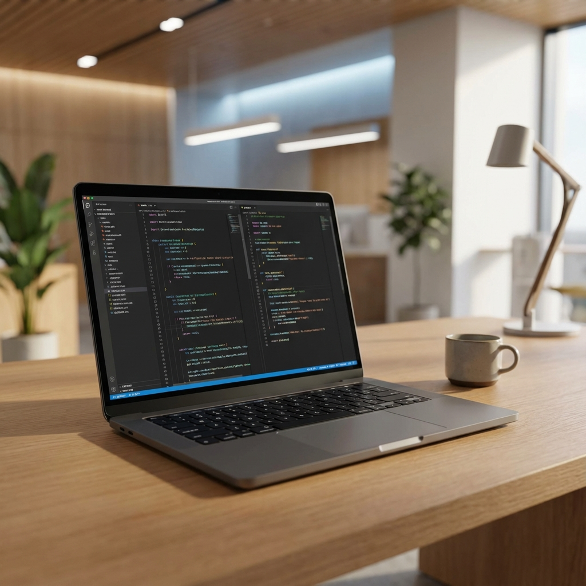
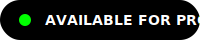
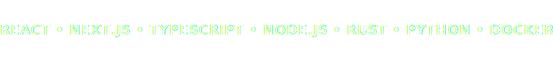

<!-- HERO SECTION -->

  

<!-- ANIMATED HEADER -->
<h1>
  
</h1>

  

 

  <b>Full Stack Software Engineer</b> &bull; <b>UI/UX Architect</b> &bull; <b>Cloud Strategist</b>

 

<!-- NAVIGATION CHIPS -->

  
  
  

<!-- TECH ARSENAL: THE ECOSYSTEM -->
<h2 id="-tech-arsenal">The Ecosystem.</h2>

A proprietary blend of cutting-edge technologies.

 

<!-- CUSTOM ANIMATED TECH MARQUEE -->

  

  
  
  
  
  
  
  
  

  

<!-- BENTO BOX PERFORMANCE SECTION -->
<h2 id="-performance">Performance.</h2>

Everything you need to know, at a glance.

 

  

 

  

 

  

  

<!-- FOOTER / CONNECT -->
<h2 id="-connect">Stay in touch.</h2>

Join the conversation.

 

  
  
  

  

  © 2025 Veera. All rights reserved.

