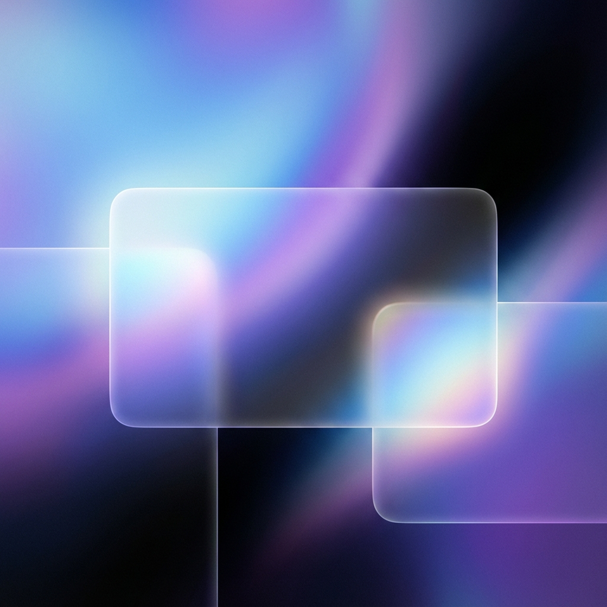
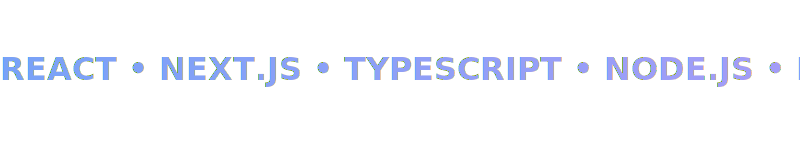

<!-- HERO SECTION: THE GLASS EXPERIENCE -->

  

<!-- ANIMATED HEADER -->
<h1>
  
</h1>

  

 

  <b>Full Stack Software Engineer</b> &bull; <b>UI/UX Architect</b> &bull; <b>Cloud Strategist</b>

 

<!-- NAVIGATION CHIPS: BUTTON STYLE -->

  
  
  

<!-- TECH ARSENAL: THE ECOSYSTEM -->
<h2 id="-tech-arsenal">The Ecosystem.</h2>

PRECISION TOOLS FOR MODERN ARCHITECTURE.

 

<!-- GLASSY ANIMATED TECH MARQUEE -->

  

  
  
  
  
  
  
  
  

  

<!-- PERFORMANCE SECTION -->
<h2 id="-performance">Performance.</h2>

METRICS THAT MATTER.

 

  
    
  

 

  

  

<!-- FOOTER / CONNECT -->
<h2 id="-connect">Stay in touch.</h2>

THE CONVERSATION STARTS HERE.

 

  
  
  

  

  DESIGNED BY APPLE IN CALIFORNIA • BUILT BY VEERA

