# Veerapandi
**Cybersecurity Engineer | DevSecOps Enthusiast | Content Creator**

  
  
  
  
  

---

### 🛡️ Mission
Transforming complex real-time systems into remote, digital, and safe security products through DevSecOps excellence.

---

### 🛤️ Cyber Roadmap

```mermaid
graph LR
    HW[Computer Hardware] --> NET[Computer Network]
    NET --> OS[Operating Systems]
    OS --> LNX[Linux]
    LNX --> SEC[Network Security]
    SEC --> GRC[GRC]
    GRC --> AUD[Security Audit]
    AUD --> VA[Vulnerability Assessment]
    VA --> OFF[Offensive Security]
    OFF --> DEF[Defensive Security]
    DEF --> INT[Internship]
    INT --> JOB[GRC Analyst / Ethical Hacker]

    style HW fill:#f9f,stroke:#333,stroke-width:2px
    style JOB fill:#00ff00,stroke:#333,stroke-width:4px
```

---

### 🎓 Academic Journey

  
- **Semester 1**: `SGPA 7.82 / 10`
- **Semester 2**: `SGPA 8.48 / 10`
- **Semester 3**: `SGPA 8.96 / 10`
- **Semester 4**: `SGPA 9.35 / 10`
- **Semester 5**: `Loading` 
- **Cumulative CGPA**: `8.64 / 10`

---

### 💼 Experience

- **Media Team Lead** | IEI Club (Sep 2025 - Present)
- **Palo Alto Internship** | Edukills, AICTE (2025 - 2026)
- **TATA Internship** | Forage (2025 - 2026)
- **Technical Team Member** | NWC Association Club (Jan 2025 - Dec 2025)
- **Content Creator** | YouTube - [The Joy Of Cyber](https://youtube.com) (Dec 2024 - Present)

---

### 📜 Certifications & Achievements

**Completed Certificates:**
- NPTEL: System Security
- NPTEL: Ethical Hacker
- NPTEL: Java Programmer

**In Progress:**
- [x] Certified in Cybersecurity (ISC)²

**Upcoming Milestones:**
- ITIL
- Cambridge English Certificate
- ISO 27001 Certificate
- Certified Ethical Hacker (CEH)

---

### 📊 Vital Signs

  
   
  

---

### 🔗 Connect

  <a href="https://veerapandig.vercel.app"><b>Portfolio Website</b></a> • 
  <a href="https://linkedin.com/in/veera-crt"><b>LinkedIn</b></a> • 
  <a href="mailto:veera@example.com"><b>Email</b></a>

