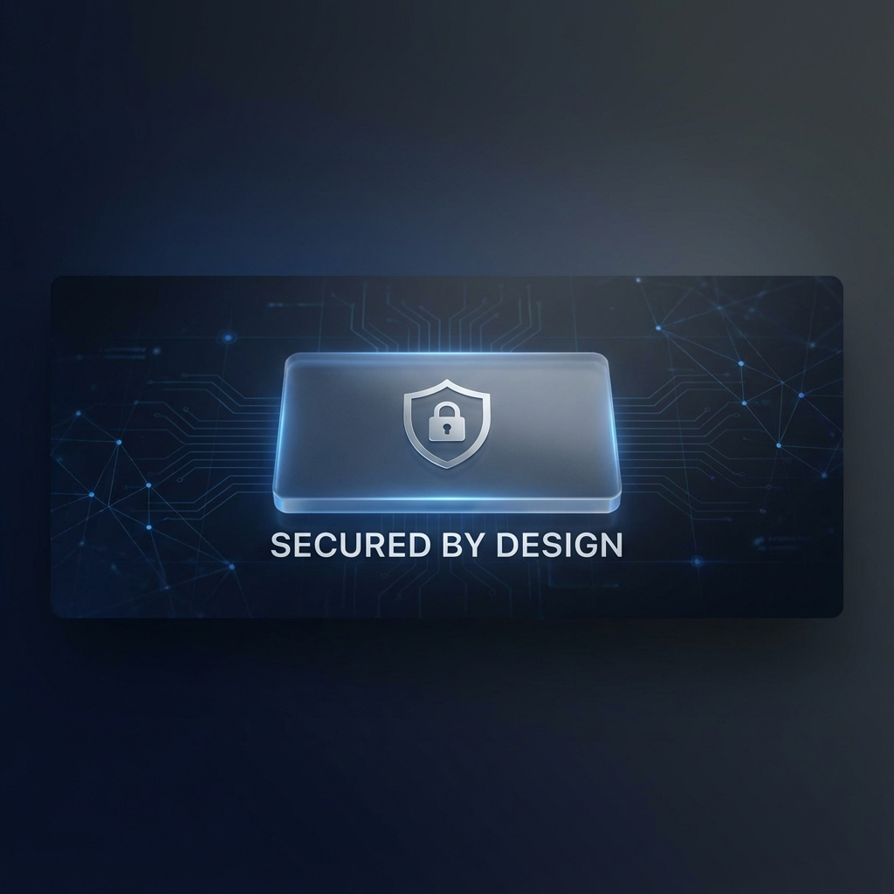

<!-- HEADER SECTION -->

  

# 🛡️ VEERAPANDI
**Cybersecurity Engineer | DevSecOps | Digital Architect**

 

  

 

<!-- MISSION SECTION -->
<table width="100%">
  <tr>
    <td align="center" style="background: linear-gradient(135deg, #0a0a0a 0%, #1a1a1a 100%); border-radius: 20px; padding: 30px; border: 1px solid #333;">
      <h3 style="color: #7aa2f7; font-family: 'SF Pro Display', sans-serif; letter-spacing: 2px;">THE OPERATION</h3>
      

        "I transform complex real-time systems into remote, digital, and safe security products.   
        Engineering trust at the intersection of <b>Cybersecurity</b> and <b>DevSecOps</b>."
      

    </td>
  </tr>
</table>

 

<!-- ROADMAP SECTION -->
<table width="100%">
  <tr>
    <td align="center" style="background: #0d1117; border-radius: 20px; padding: 25px; border: 1px solid #30363d;">
      <h3 style="color: #bb9af7;">CYBER DEFENSE ROADMAP</h3>
       
      
    </td>
  </tr>
</table>

 

<!-- MIDDLE GRID -->
<table width="100%">
  <tr>
    <td width="50%" valign="top" style="background: #0d1117; border-radius: 20px; padding: 20px; border: 1px solid #30363d;">
      <h3 align="center" style="color: #7dcfff;">⚡ TECH STACK</h3>
      

      

        
        
        
         
        
        
        
      

       
      <h3 align="center" style="color: #7dcfff;">📜 CERTIFICATIONS</h3>
      

      
<b>ACTIVE:</b> (ISC)² CC 

      
<b>NPTEL:</b> System Security | Ethical Hacker | Java

      
<b>UPCOMING:</b> CEH, ISO 27001, ITIL

    </td>
    <td width="50%" valign="top" style="background: #0d1117; border-radius: 20px; padding: 20px; border: 1px solid #30363d;">
      <h3 align="center" style="color: #9ece6a;">🎓 ACADEMICS</h3>
      

      

        
<b>Sem 1:</b> 7.82 

        
<b>Sem 2:</b> 8.48 

        
<b>Sem 3:</b> 8.96 

        
<b>Sem 4:</b> 9.35 

        
<b>Sem 5:</b> Loading... 

        
<b>CGPA: 8.64 / 10</b>

      

    </td>
  </tr>
</table>

 

<!-- EXPERIENCE SECTION -->
<table width="100%">
  <tr>
    <td style="background: #0d1117; border-radius: 20px; padding: 25px; border: 1px solid #30363d;">
      <h3 align="center" style="color: #e0af68;">� PROFESSIONAL FOOTPRINT</h3>
      

      

        
🔘 <b>Media Team Lead</b> @ IEI Club <small>(Sep 2025 - Present)</small>

        
🔘 <b>Palo Alto Internship</b> @ Edukills <small>(2025 - 2026)</small>

        
🔘 <b>TATA Internship</b> @ Forage <small>(2025 - 2026)</small>

        
🔘 <b>Technical Member</b> @ NWC Association <small>(Jan 2025 - Dec 2025)</small>

        
🔘 <b>Content Creator</b> @ [The Joy Of Cyber](https://youtube.com) <small>(Dec 2024 - Present)</small>

      

    </td>
  </tr>
</table>

 

<!-- ANALYTICS SECTION -->
<table width="100%">
  <tr>
    <td align="center" style="background: #0d1117; border-radius: 20px; padding: 25px; border: 1px solid #30363d;">
      <h3 style="color: #f7768e;">NETWORK ACTIVITY</h3>
       
      
      
        
      
    </td>
  </tr>
</table>

  

  

